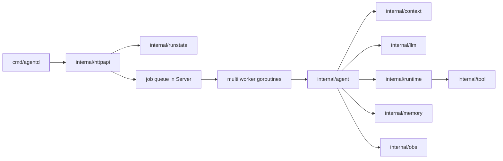
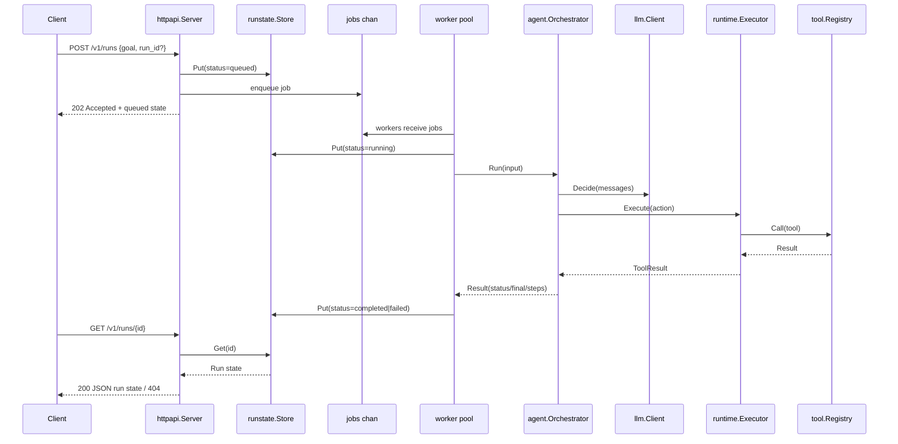

# OpenClaw Go Architecture (Current Phase)

This page visualizes the current migration phase after introducing async run execution.

## Module Relationship Diagram

## Data Flow Diagram

## Notes

- `POST /v1/runs` is asynchronous and returns quickly with queue-backed status.
- `POST /v1/runs` can be guarded by optional Bearer ingress API key.
- `POST /v1/runs` supports per-client fixed-window rate limiting (`429` + `Retry-After`).
- `POST /v1/runs` enforces strict JSON decoding and max request body size guardrails (`413`/`400`).
- `httpapi.Config` controls queue depth, worker count, and per-run timeout.
- `httpapi.Server.Close` drains accepted jobs before worker shutdown.
- Queue dispatch remains FIFO with concurrent execution when multiple workers are configured.
- Run state is currently in-memory and scoped to a single process.
