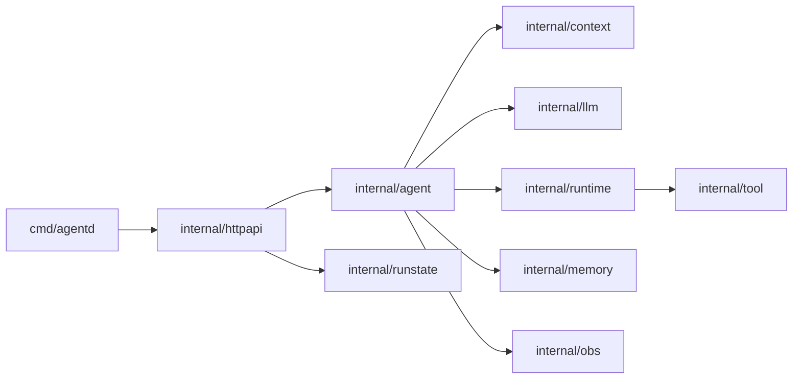
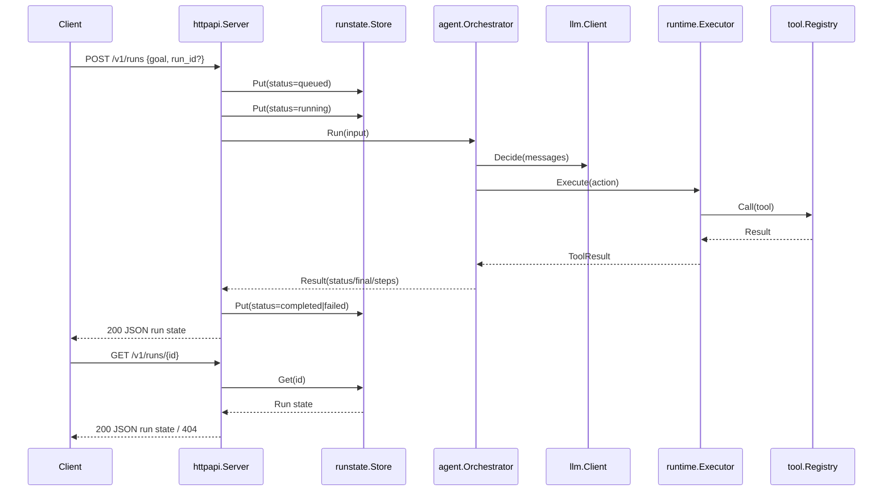

# OpenClaw Go Architecture (Current Phase)

This page visualizes the current migration phase after introducing run lifecycle tracking.

## Module Relationship Diagram

## Data Flow Diagram

## Notes

- This phase keeps execution synchronous for easier migration verification.
- Run state is currently in-memory and scoped to a single process.
- Next phase can switch `POST /v1/runs` to async queue + worker without breaking `GET /v1/runs/{id}` contract.

